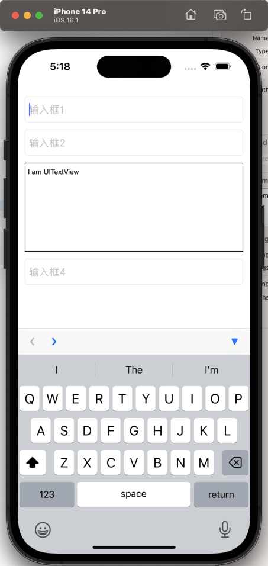

# XQUITextField_Navigation

对 [UITextField_Navigation](https://github.com/T-Pham/UITextField-Navigation) 库的一些封装


# 导入

```
pod 'XQUITextField_Navigation', :git => 'https://github.com/SyKingW/XQUITextField_Navigation.git'
```


# 使用

把该 view 下面所有的 TextField 和 textView 连起来，效果如下图

```swift
self.view.xq_showTextField_Navigation()
```




